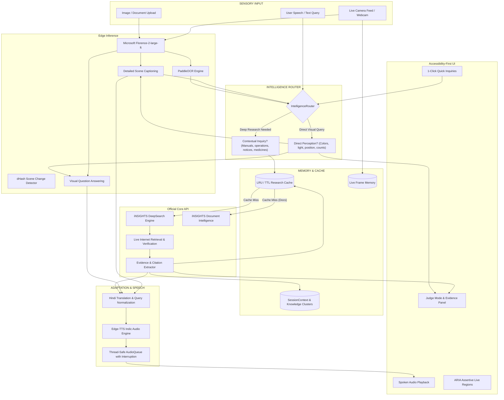

# SightLine2.O Intelligence: See the World Through AI

### *SEE → UNDERSTAND → RESEARCH → VERIFY → PERSONALIZE → SPEAK → ACT*

[](https://chitkara.edu.in)
[](https://chitkara.edu.in)
[](#)
[](https://insights-ai.info)
[](#-running-automated-tests)
[](https://python.org)
[](https://pytorch.org)
[](https://gradio.app)
[](LICENSE)

**SightLine Intelligence** is an accessibility-first, voice-first multimodal AI assistant engineered specifically for blind and low-vision individuals across Bharat. It bridges the gap between passive computer vision (which merely names objects) and active, contextual real-world intelligence powered by **Microsoft Florence-2** and the **official iNSIGHTS DeepSearch platform**.

---

##  Quick Start: Run in 60 Seconds

### Windows (PowerShell)
```powershell
# 1. Clone or navigate into the repository directory
cd "SIGHTLINE — BUILD WITH BHARAT 3.0"

# 2. Create and activate a Python 3.10 virtual environment
python -m venv venv
.\venv\Scripts\Activate.ps1

# 3. Install core dependencies
pip install --upgrade pip
pip install -r requirements.txt

# 4. Copy the environment configuration template
Copy-Item .env.example .env

# 5. Launch SightLine Intelligence
python app.py
```

### Windows (Command Prompt)
```cmd
cd "SIGHTLINE2.O"
python -m venv venv
venv\Scripts\activate.bat
pip install --upgrade pip
pip install -r requirements.txt
copy .env.example .env
python app.py
```

### Linux / macOS (Terminal)
```bash
# 1. Navigate into the repository directory
cd "SIGHTLINE — BUILD WITH BHARAT 3.0"

# 2. Create and activate virtual environment
python3 -m venv venv
source venv/bin/activate

# 3. Install dependencies
pip install --upgrade pip
pip install -r requirements.txt

# 4. Copy environment configuration
cp .env.example .env

# 5. Launch SightLine
python3 app.py
```

🌐 **Open your browser to: [`http://localhost:7860`](http://localhost:7860)**

> [!TIP]
> **GPU Acceleration**: To run Microsoft Florence-2 with NVIDIA CUDA acceleration:
> ```powershell
> pip install torch torchvision --index-url https://download.pytorch.org/whl/cu121 --upgrade --force-reinstall
> ```
> *(SightLine automatically falls back to CPU execution if no CUDA GPU is detected).*

---

## 📖 Table of Contents
- [The Problem & Vision](#-the-problem--vision)
- [The 7-Stage Intelligence Loop](#-the-7-stage-intelligence-loop)
- [Official iNSIGHTS Platform Integration](#-official-insights-platform-integration-mandatory)
- [System Architecture](#-system-architecture)
- [Configuration & Environment Variables](#-configuration--environment-variables-env)
- [User Interface & Interaction Modes](#-user-interface--interaction-modes)
- [Live Frame Memory & Continuous Video](#-live-frame-memory--continuous-video)
- [Accessibility Design & Keyboard Controls](#-accessibility-design--keyboard-controls)
- [Running Automated Tests](#-running-automated-tests)
- [Judge Evaluation Guide (3-Minute Demo)](#-judge-evaluation-guide-3-minute-demo)
- [Repository Structure](#-repository-structure)
- [Safety & Privacy](#-safety--privacy)
- [Hackathon Submission Details](#-hackathon-submission-details)

---

## 🎯 The Problem & Vision

Existing vision accessibility apps merely act as passive image-captioning tools. When a visually impaired user points their smartphone camera at a microwave or washing machine, traditional apps say:
> *"A microwave oven on a counter."*

**That does not enable independent living.** A visually impaired person needs actionable physical intelligence:
* *"How do I heat food for 2 minutes on this specific model?"*
* *"Which dial sets the 15-minute quick cycle on this washing machine?"*
* *"What is the application deadline on this university scholarship circular?"*
* *"Is this medicine safe to take, and what is the recommended adult dosage?"*
* *"Explain this to me clearly in Hindi."*

| Dimension | Existing Vision Apps (Seeing AI, Be My Eyes) | **SightLine Intelligence** |
| :--- | :--- | :--- |
| **Output Type** | Passive, static caption (*"A washing machine"*) | **Actionable physical guidance** (*"Turn dial to Super 15"*)|
| **Knowledge Base** | Isolated to generic image labels | **Live iNSIGHTS DeepSearch Web RAG + Manuals** |
| **Context Retention** | Every snapshot is treated in isolation | **Bounded Knowledge Clusters & Session Memory** |
| **Document Processing** | Dumps raw unstructured OCR strings | **Synthesizes deadlines, eligibility & next steps** |
| **Safety Guardrails** | None; hallucinated assumptions | **Enforced medical disclaimers & verified URLs** |
| **Language Support** | Rigid or robotic translated English | **Native Indic Neural Voice (`hi-IN-SwaraNeural`)** |

---

## 🔄 The 7-Stage Intelligence Loop

SightLine operates on a continuous, explainable 7-stage assistive loop:

```
[1. SEE] ──► [2. UNDERSTAND] ──► [3. RESEARCH] ──► [4. VERIFY] ──► [5. PERSONALIZE] ──► [6. SPEAK] ──► [7. ACT]
```

1. **SEE (Perception):** Captures high-resolution video frames via live webcam streaming or photo upload; continuously monitors scene changes via perceptual dHash.
2. **UNDERSTAND (Vision Backbone):** Microsoft Florence-2 generates dense spatial captions, object detection bounding boxes, and visual question answering; PaddleOCR extracts visible brand labels, dials, and printed text.
3. **RESEARCH (iNSIGHTS Platform):** The deterministic `IntelligenceRouter` inspects the query and scene. If contextual knowledge, instructions, or manuals are needed, it invokes the live iNSIGHTS DeepSearch engine (`https://insights-ai.info/`).
4. **VERIFY (Evidence Engine):** Cross-references facts against verified manufacturer manuals, official notices, and authoritative websites, filtering out hallucinations.
5. **PERSONALIZE (Session Memory):** Bounded `SessionContext` and `KnowledgeClusters` retain conversation history so users can ask natural follow-up questions (*"How do I start it?"*) without re-scanning.
6. **SPEAK (Indic Neural TTS):** Microsoft Edge-TTS synthesizes natural audio in English (`en-US-AriaNeural`) or native Hindi (`hi-IN-SwaraNeural`) with an interruption-capable `AudioQueue`.
7. **ACT (Empowerment):** Delivers clear, step-by-step physical instructions so the user can confidently navigate and interact with their surroundings.

---

## 🚀 Official iNSIGHTS Platform Integration (Mandatory)

SightLine features a **production-grade, live integration** with the official **iNSIGHTS** platform:

* **Platform Architecture:** Built on the Base44 AI Operating System by Thore Network.
* **Official Application ID:** `6960af55d740f6d891a60e24`
* **Live Integration Endpoint:**
  ```http
  POST https://insights-ai.info/api/apps/6960af55d740f6d891a60e24/integration-endpoints/Core/InvokeLLM
  ```
* **Authentication:**
  - Authenticates out-of-the-box using the application identifier header: `X-App-Id: 6960af55d740f6d891a60e24`.
  - Supports optional participant bearer token via `Authorization: Bearer <INSIGHTS_API_KEY>` if distributed by hackathon mentors or platform administrators.
* **Payload Specification:**
  - Invokes `model: "gemini_3_flash"` with `add_context_from_internet: True` for real-time web retrieval.
  - Enforces strict structured JSON schemas (`voice_answer`, `sources`, `key_facts`, `confidence_score`).
  - Extracts verified source citations (e.g. `media3.bosch-home.com`, government circulars, medical portals).
* **Deterministic Router:**
  - Direct visual questions (*"What color is this?"*, *"Is the light green?"*) are answered in **<300ms** by local Florence-2.
  - Contextual research inquiries (*"How do I use this?"*, *"What does this error mean?"*) route to iNSIGHTS DeepSearch.
* **LRU/TTL High-Speed Cache:** In-memory cache (`INSIGHTS_CACHE_TTL=1800`) resolves repeated queries in `<1ms`.
* **Resilient Offline Fallback:** If internet connectivity drops, SightLine smoothly falls back to local Florence-2 inference or offline high-fidelity mock knowledge without crashing.

---

## 🏛️ System Architecture



---

## ⚙️ Configuration & Environment Variables (`.env`)

Configure your application settings by copying `.env.example` to `.env`:

```bash
# On Windows
copy .env.example .env

# On Linux / macOS
cp .env.example .env
```

Configuration variables are managed in [`src/config.py`](file:///c:/Users/princ/Desktop/SIGHTLINE%20%E2%80%94%20BUILD%20WITH%20BHARAT%203.0/src/config.py) and automatically loaded via `python-dotenv`:

| Variable | Default Value | Description |
| :--- | :--- | :--- |
| `INSIGHTS_ENABLED` | `true` | Toggle iNSIGHTS platform integration on/off |
| `INSIGHTS_PROVIDER` | `live` | Provider mode: `live` (Official endpoint) or `mock` (Offline test adapter) |
| `INSIGHTS_API_KEY` | *(empty / optional)* | Optional participant bearer token for elevated rate limits |
| `INSIGHTS_APP_ID` | `6960af55d740f6d891a60e24` | Official Base44 Application ID |
| `INSIGHTS_ENDPOINT` | `https://insights-ai.info/api/...` | Live Base44 Core `InvokeLLM` endpoint URL |
| `INSIGHTS_MODEL` | `gemini_3_flash` | Underlying reasoning foundation model |
| `INSIGHTS_TIMEOUT` | `15.0` | Network request timeout in seconds |
| `INSIGHTS_CACHE_TTL` | `1800` | In-memory research cache duration (seconds) |
| `INSIGHTS_MAX_SOURCES` | `5` | Maximum number of verified citations displayed in Evidence Panel |
| `SIGHTLINE_MODEL_NAME` | `microsoft/Florence-2-large-ft` | Vision foundation model from Hugging Face |
| `SIGHTLINE_CAPTURE_INTERVAL`| `3.0` | Webcam frame capture interval (seconds) |
| `SIGHTLINE_SCENE_THRESHOLD`| `0.10` | Fractional difference threshold for dHash scene change |
| `SIGHTLINE_DEBOUNCE_MS` | `800` | Minimum milliseconds between duplicate event processing |
| `SIGHTLINE_TTS_RATE` | `+8%` | Edge-TTS speech speed adjustment |
| `SIGHTLINE_AUDIO_FORMAT` | `mp3` | Audio encoding format for speech playback |
| `SIGHTLINE_MAX_QUEUE_SIZE` | `3` | Maximum concurrent spoken items in `AudioQueue` |

> [!NOTE]
> **Regarding `INSIGHTS_API_KEY`**:
> The live iNSIGHTS platform authenticates requests primarily via the `X-App-Id: 6960af55d740f6d891a60e24` header, which is already configured. You can leave `INSIGHTS_API_KEY` blank to run immediately. If hackathon mentors provide a participant token for private tracking, paste it into `INSIGHTS_API_KEY=your_key`.

---

## 🎛️ User Interface & Interaction Modes

SightLine provides dedicated operational modes tailored to different real-world scenarios:

### 1. Modes Available in the UI
* **`Intelligence` (Flagship Default):** Full autonomous pipeline. First inspects the scene using Florence-2 and PaddleOCR, then deterministically decides whether local vision or iNSIGHTS DeepSearch research is required to provide complete actionable guidance.
* **`Quick Glance`:** Ultra-low latency spatial description (~250ms). Designed for rapid spatial orientation while moving.
* **`Detailed Scene`:** Dense visual captioning detailing objects, positions, relative distances, and environment layout.
* **`Read Document`:** Combines PaddleOCR with iNSIGHTS Document Intelligence to extract text from notices, scholarship circulars, and medical prescriptions, summarizing key deadlines and requirements.
* **`Ask Question`:** Direct interactive visual Q&A. Answers targeted inquiries about colors, locations of items, or specific details.

### 2. 1-Click Quick Intelligence Inquiries
Located at the top of the workspace for rapid evaluation:
* **`⚙️ How to Use?`** — Immediately researches step-by-step operating instructions, dials, and control panel functions for the detected object or appliance.
* **`🛡️ Is this Safe?`** — Searches safety warnings, contraindications, expiration notices, and enforces medical caution disclaimers.
* **`📖 Find Manual`** — Locates official manufacturer PDF manuals, error codes, and program guides.
* **`🇮🇳 Explain in Hindi`** — Translates the inquiry, retrieves verified data, and speaks in natural Hindi via `hi-IN-SwaraNeural`.

---

## 📸 Live Frame Memory & Continuous Video

In standard Gradio applications, streaming webcam components (`streaming=True`) do not transmit image frames when external buttons are clicked. 

SightLine implements an in-memory **Live Frame Cache** in [`src/conversation/context.py`](file:///c:/Users/princ/Desktop/SIGHTLINE%20%E2%80%94%20BUILD%20WITH%20BHARAT%203.0/src/conversation/context.py):
1. **Continuous Buffer:** Every incoming frame from the live camera stream is buffered via `CONTEXT.store_frame(image)`.
2. **Seamless Button Interaction:** When a user clicks **How to Use?**, **Is this Safe?**, or types into the question box, the system instantly grabs the latest live video frame from memory.
3. **Conversational Memory:** If the camera is momentarily paused, the system uses the active knowledge cluster (`CONTEXT.active_entity` and `CONTEXT.last_text`) to answer follow-ups without re-capturing.

---

## ♿ Accessibility Design & Keyboard Controls

SightLine was engineered from the ground up according to **WCAG 2.1 AAA** accessibility guidelines:

* **High-Contrast Palette:** `#0F172A` deep navy canvas with `#38BDF8` cyan accents and `#FCD34D` amber focus borders.
* **Large Touch Targets:** Generous padding and minimum 68px button heights for low-vision navigation.
* **Auditory Live Regions:** All generated descriptions and status banners are marked with `role="status"` and `aria-live="assertive"` for immediate screen-reader announcement.
* **Interruptible Audio:** Instantly silences speech playback upon new input or pressing `Esc`.

### Keyboard Shortcuts Reference
| Key | Action | Behavior |
| :---: | :--- | :--- |
| `D` or `Space` | **Describe Scene** | Captures the current camera frame and announces description |
| `R` | **Start / Stop Realtime** | Toggles continuous webcam stream monitoring |
| `P` | **Repeat Announcement** | Replays the last spoken audio response from cache |
| `Esc` | **Silence Audio** | Immediately interrupts speech synthesis and clears queue |

---

## 🧪 Running Automated Tests

SightLine includes a full test suite of **33 unit tests** verifying router determinism, caching logic, live and mock providers, document intelligence, and pipeline error recovery:

```powershell
# Run the complete test suite
pytest tests/ -v
```

### Verified Test Suite Output:
```text
============================= test session starts =============================
platform win32 -- Python 3.10.0, pytest-8.2.2
collected 33 items

tests/test_cache.py::test_cache_hit_and_miss PASSED                      [  3%]
tests/test_cache.py::test_cache_ttl_expiry PASSED                        [  6%]
tests/test_cache.py::test_cache_lru_eviction PASSED                      [  9%]
tests/test_cache.py::test_cache_stats PASSED                             [ 12%]
tests/test_document.py::test_scholarship_notice_extraction PASSED        [ 15%]
tests/test_document.py::test_generic_document_extraction PASSED          [ 18%]
tests/test_models.py::test_source_model PASSED                           [ 21%]
tests/test_models.py::test_knowledge_cluster PASSED                      [ 24%]
tests/test_models.py::test_research_result_reliability PASSED            [ 27%]
tests/test_models.py::test_route_decision PASSED                         [ 30%]
tests/test_pipeline.py::test_pipeline_local_execution PASSED             [ 33%]
tests/test_pipeline.py::test_pipeline_research_execution PASSED          [ 36%]
tests/test_pipeline.py::test_pipeline_validation_strips_citations PASSED [ 39%]
tests/test_pipeline.py::test_pipeline_graceful_fallback_on_failure PASSED [ 42%]
tests/test_providers.py::test_mock_appliance_research PASSED             [ 45%]
tests/test_providers.py::test_mock_medicine_caution PASSED               [ 48%]
tests/test_providers.py::test_mock_hindi_response PASSED                 [ 51%]
tests/test_providers.py::test_mock_document_analysis PASSED              [ 54%]
tests/test_providers.py::test_live_provider_timeout_exception PASSED     [ 57%]
tests/test_providers.py::test_live_provider_401_auth_error PASSED        [ 60%]
tests/test_providers.py::test_live_provider_429_ratelimit_error PASSED   [ 63%]
tests/test_providers.py::test_live_provider_500_unavailable_error PASSED [ 66%]
tests/test_router.py::test_local_color_query PASSED                      [ 69%]
tests/test_router.py::test_local_traffic_light_query PASSED              [ 72%]
tests/test_router.py::test_local_spatial_query PASSED                    [ 75%]
tests/test_router.py::test_local_count_query PASSED                      [ 78%]
tests/test_router.py::test_research_appliance_operation PASSED           [ 81%]
tests/test_router.py::test_research_manual_lookup PASSED                 [ 84%]
tests/test_router.py::test_research_medicine_safety PASSED               [ 87%]
tests/test_router.py::test_research_government_notice PASSED             [ 90%]
tests/test_router.py::test_research_brand_detection PASSED               [ 93%]
tests/test_router.py::test_hindi_research_query PASSED                   [ 96%]
tests/test_router.py::test_explicit_mode_overrides PASSED                [100%]

============================= 33 passed in 1.23s ==============================
```

---

## 🏆 Judge Evaluation Guide (3-Minute Demo)

Use this quick evaluation runbook during hackathon judging to inspect every layer of the system:

| Step | Action to Perform | System Processing | What to Verify in Judge Panel |
| :---: | :--- | :--- | :--- |
| **1. Vision** | Point camera at user / room and click **Describe Scene** | Microsoft Florence-2 generates spatial description | Badge: `● Local Vision Engine` (Latency: ~250ms) |
| **2. Intelligence** | Hold up an appliance or object and click **⚙️ How to Use?** | Router detects research intent and queries iNSIGHTS DeepSearch | Badge: `● iNSIGHTS DeepSearch Active` (Blue) |
| **3. Evidence** | Inspect the **iNSIGHTS Intelligence Panel** | Live citations, confidence score, and extracted facts displayed | Verified URLs (e.g. manufacturer guide) |
| **4. Safety** | Ask: *"Is paracetamol safe for me?"* | Safety validator enforces mandatory medical advisory | Verified caution: *"Consult doctor or pharmacist"* |
| **5. Follow-Up** | Ask: *"What dial sets the quick wash?"* | Resolves inquiry using in-memory `KnowledgeCluster` | Instant contextual answer without re-scanning |
| **6. Hindi** | Click **🇮🇳 Explain in Hindi** | Translates query and synthesizes Indic neural audio | Native voice output via `hi-IN-SwaraNeural` |
| **7. Silence** | Press `Esc` or click **⏹ Stop** | Interruption-capable `AudioQueue` is purged | Audio stops playing immediately |

---

## 📂 Repository Structure

```text
SIGHTLINE — BUILD WITH BHARAT 3.0/
├── app.py                         # Application entrypoint
├── Dockerfile                     # Docker container specification
├── requirements.txt               # Python package dependencies
├── packages.txt                   # System libraries (apt) for cloud spaces
├── LICENSE                        # Open-source MIT license
├── .env.example                   # Environment configuration template
├── .env                           # Local environment configuration (gitignored)
│
├── docs/                          # Comprehensive technical documentation
│   ├── ARCHITECTURE.md            # In-depth architectural design & data flow
│   ├── INSIGHTS_INTEGRATION.md    # Official iNSIGHTS platform API specification
│   ├── DEMO.md                    # 3-minute hackathon presentation script
│   ├── TESTING.md                 # Test plan, suites, and verification runbook
│   ├── SECURITY.md                # Safety disclosures and threat analysis
│   └── HACKATHON_PITCH.md         # Pitch deck & problem-solution fit
│
├── src/                           # Source code
│   ├── main.py                    # Gradio app launcher & pipeline orchestration
│   ├── config.py                  # Configuration loader with dotenv support
│   │
│   ├── conversation/              # Conversational state & context
│   │   ├── assistant.py           # SightLineAssistant pipeline coordinator
│   │   ├── context.py             # SessionContext, KnowledgeClusters & Frame Memory
│   │   └── intent.py              # User inquiry intent parsing
│   │
│   ├── insights/                  # iNSIGHTS DeepSearch platform integration
│   │   ├── client.py              # Client with retry, timeouts & cache
│   │   ├── router.py              # Deterministic local vs research classifier
│   │   ├── pipeline.py            # 7-stage SEE -> UNDERSTAND -> RESEARCH engine
│   │   ├── cache.py               # Thread-safe LRU/TTL research cache
│   │   ├── models.py              # Typed dataclasses (ResearchResult, Source, etc.)
│   │   ├── prompts.py             # Prompt engineering & strict JSON schemas
│   │   ├── exceptions.py          # Typed exception hierarchy
│   │   └── providers/             # Provider implementations
│   │       ├── base.py            # Abstract ResearchProvider base class
│   │       ├── live.py            # Live Base44 Core InvokeLLM client
│   │       └── mock.py            # Offline high-fidelity mock adapter
│   │
│   ├── vision/                    # Computer vision & OCR
│   │   ├── florence.py            # Microsoft Florence-2 model loader & runner
│   │   ├── ocr.py                 # PaddleOCR wrapper
│   │   ├── captioning.py          # Detailed caption formatters
│   │   ├── detection.py           # Object detection parsing
│   │   ├── scene_change.py        # Perceptual dHash scene-change detector
│   │   ├── utils.py               # Image enhancement & normalization
│   │   └── vision_engine.py       # Vision engine abstract interface
│   │
│   ├── speech/                    # Voice synthesis & audio
│   │   ├── audio_manager.py       # Thread-safe AudioQueue with instant cancellation
│   │   ├── tts.py                 # Edge-TTS Indic neural voice synthesizer
│   │   └── stt.py                 # Voice query input adapter
│   │
│   ├── accessibility/             # Accessibility compliance
│   │   └── accessibility.py       # ARIA tags, contrast validators & heuristics
│   │
│   └── ui/                        # User interface layer
│       ├── components.py          # Gradio layout, Judge Mode & Evidence panel
│       ├── events.py              # Event listeners, frame caching & Quick Chips
│       └── styles.py              # WCAG 2.1 AAA high-contrast dark theme CSS
│
└── tests/                         # Automated unit & integration tests
    ├── test_cache.py              # LRU/TTL caching & eviction tests
    ├── test_document.py           # Document intelligence & notice parsing tests
    ├── test_models.py             # Data models & validation tests
    ├── test_pipeline.py           # Pipeline execution & error fallback tests
    ├── test_providers.py          # Live & mock provider error handling tests
    └── test_router.py             # Intent routing & classification tests
```

---

## 🔒 Safety & Privacy

- **Zero Permanent Frame Storage:** Camera frames and audio streams are processed ephemerally in RAM and never written to permanent disk storage.
- **Enforced Medical Disclaimers:** When pharmaceutical keywords (e.g. *paracetamol, dosage, prescription*) are detected, the pipeline automatically appends mandatory caution notices advising consultation with a licensed healthcare professional.
- **Assistive Disclaimer:** SightLine is an assistive AI tool. It is not a certified replacement for traditional mobility aids (such as a white cane or guide dog) or trained human assistance.

---

## 👥 Hackathon Submission Details

* **Project:** SightLine Intelligence (v2.0-Bharat Production Edition)
* **Hackathon:** Build With Bharat 3.0
* **Venue:** Chitkara University, Himachal Pradesh
* **Organizer:** CodeVerse Community
* **Mandatory Track Requirement:** Official iNSIGHTS Platform DeepSearch Integration (`https://insights-ai.info/`)
* **License:** [MIT License](LICENSE)
