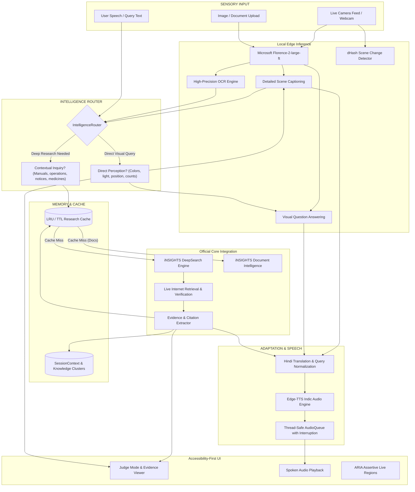

# SightLine Intelligence Architecture

## Overview
**SightLine Intelligence** transforms assistive visual AI from a passive image-captioning tool into an active, contextual intelligence assistant:
$$\text{SEE} \longrightarrow \text{UNDERSTAND} \longrightarrow \text{RESEARCH} \longrightarrow \text{VERIFY} \longrightarrow \text{PERSONALIZE} \longrightarrow \text{SPEAK} \longrightarrow \text{ACT}$$

Built for **Build With Bharat 3.0** at Chitkara University, Himachal Pradesh, SightLine enables blind and low-vision individuals to navigate, inspect, research, and operate complex physical objects, appliances, documents, and medications independently.

---

## High-Level System Architecture

---

## Component Architecture

### 1. Vision Perception Engine (`src/vision/`)
- **Model:** Microsoft Florence-2-large-ft (`0.7B` parameters), loaded on GPU (`CUDA`) or CPU fallback.
- **Tasks:**
  - `<CAPTION>`: Fast, lightweight glance (64 tokens).
  - `<DETAILED_CAPTION>`: Rich scene understanding (120 tokens).
  - `<MORE_DETAILED_CAPTION>`: Full environmental description (200 tokens).
  - `<OCR>`: PaddleOCR fallback with high-precision text recognition.
  - `<VQA>`: Natural language visual question answering.
- **Scene Change Detection:** Difference hash (`dHash`) with normalized Hamming distance threshold (`0.10`) prevents repetitive processing of static frames.

### 2. Intelligence Router (`src/insights/router.py`)
- **Deterministic & Explainable:** Inspects the query, OCR tokens, and visual description using regular expressions and semantic classifiers.
- **Routing Rules:**
  - **Local Vision:** Visual perception questions (*"What color is this shirt?"*, *"Is the traffic light red?"*, *"Where are my keys?"*, *"How many people are here?"*).
  - **iNSIGHTS Research:** Operational questions (*"How do I use this?"*, *"Find the manual"*, *"What does this error code mean?"*, *"Is this medicine safe?"*, *"What does this university notice announce?"*).

### 3. Official iNSIGHTS Integration Layer (`src/insights/`)
- **Provider Interface:** `ResearchProvider` abstract base class decouples network protocols from business logic.
- **Live Provider (`InsightsLiveProvider`):**
  - Targets the official Base44 Core InvokeLLM endpoint: `https://insights-ai.info/api/apps/6960af55d740f6d891a60e24/integration-endpoints/Core/InvokeLLM`.
  - Sends structured prompts with `add_context_from_internet: True` and enforces strict JSON schemas (`response_json_schema`).
  - Incorporates exponential backoff retry, typed exception handling, and configurable timeouts.
- **Mock Provider (`MockResearchProvider`):** High-fidelity offline adapter for offline demos and CI/CD testing.
- **Research Cache (`src/insights/cache.py`):** Thread-safe LRU cache with configurable TTL (default 1800s) keyed on `(query, entity, ocr, language)`.

### 4. Bounded Context & Knowledge Graph (`src/conversation/context.py`)
- **Knowledge Clusters:** Structured representation of physical entities:
  $$\text{Entity} \longrightarrow \{\text{Brand, Model, Controls, Programs, Safety, Maintenance, Manual URL}\}$$
- **Thread-Safe Bounded Memory:** Bounded to 10 entities, 30 verified facts, and 20 sources to prevent unbounded memory growth during continuous operation.
- **Conversational Memory:** Enables natural follow-up questions without restarting research from scratch (*"What is this?"* $\rightarrow$ *"How do I start it?"*).

### 5. Accessibility-First UI & Judge Mode (`src/ui/`)
- **High-Contrast Palette:** Dark theme with slate/cyan/green accents, yellow focus outlines, and minimum 68px touch targets.
- **Judge Mode Panel:** Demonstrates live integration transparency:
  - Route badge: `● Local Vision` vs `● iNSIGHTS Research`
  - Route Rationale explanation
  - Detected Entity, Confidence, Sources count, Latency
  - Collapsible Evidence Viewer with clickable URLs and source type tags
  - 1-Click Quick Inquiries (*How to Use*, *Safety*, *Manual*, *Hindi*).
